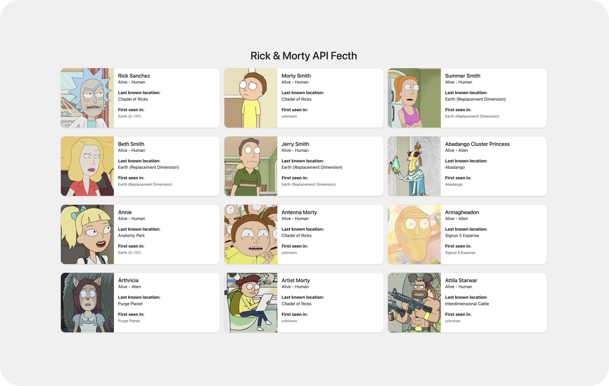

# Dynamic API Fetch - Rick and Morty API

## Description

Welcome to this project focused on dynamic API fetch using The Rick and Morty API. We've created a dynamic fetch that utilizes a page variable to continuously fetch data, enabling infinite scrolling.

In this project, we've used Bootstrap, CSS, HTML, and a few JavaScript techniques to achieve the desired functionality. Additionally, we've incorporated the `createRange` and `createContextualFragment` methods with brief explanations, both in less than 2 lines.

## Technologies Used

Here are the technologies and tools we've used in this project:

- **HTML5:** HTML5 is the foundation for organizing web content and ensuring cross-device compatibility.

- **CSS3:** CSS3 enables us to style and enhance the visual aspects of our web layout, promoting creativity and design consistency.

- **JavaScript:** JavaScript adds dynamic and interactive elements, enhancing the user experience and enabling advanced functionalities.

- **Bootstrap:** We've leveraged Bootstrap to streamline our project's responsive design and UI components.

## Features

- **Dynamic Fetch:** Our project demonstrates a dynamic API fetch, allowing us to load data as the user scrolls, creating an infinite scrolling effect.

- **Bootstrap Styling:** We've utilized Bootstrap to enhance the styling and responsiveness of our project.

## Acknowledgments

This project was made possible with the help of the IT Academy community and its vibrant Discord group.

## About Me

I'm a junior web developer with a passion for turning wireframes into beautiful web layouts. I'm here to share the knowledge I've gained with everyone who's on a similar journey.

## Contact

If you have any questions or suggestions, feel free to reach out to me via email: [codenaud@gmail.com](mailto:codenaud@gmail.com).

Happy coding! 🚀
